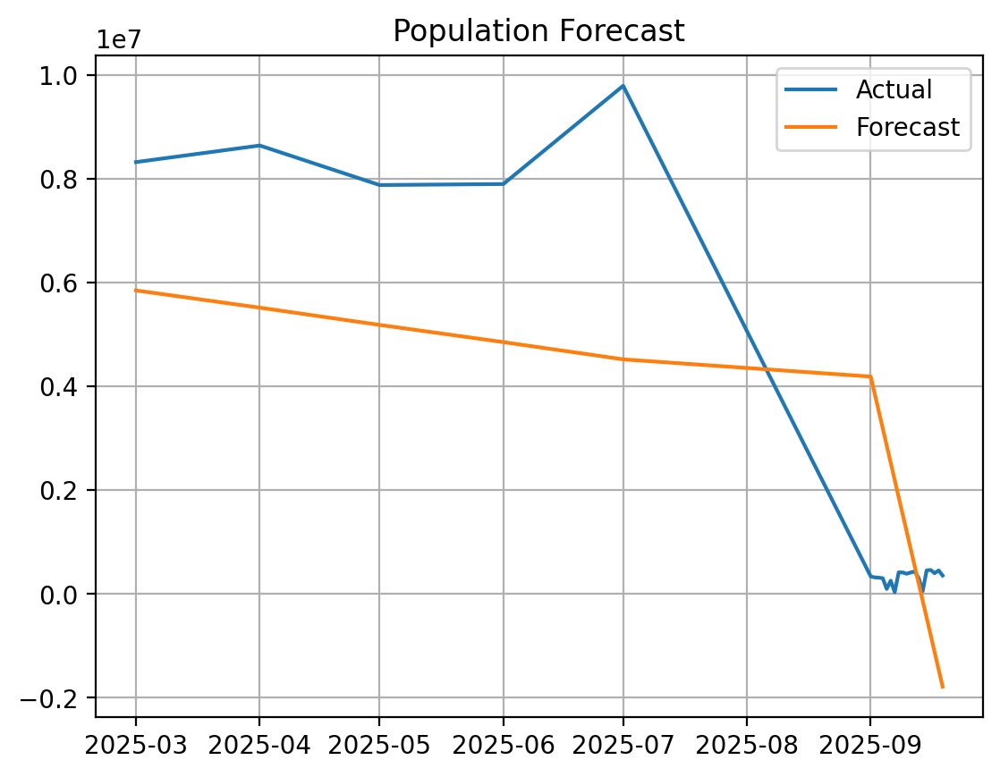
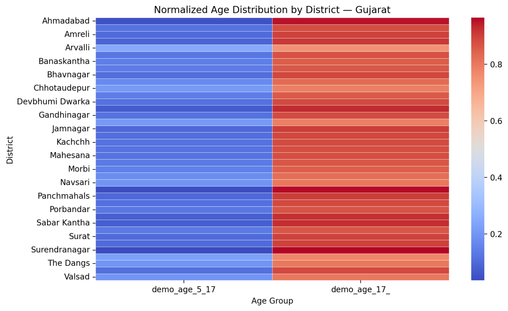

#  Unified Demographic Analytics Dashboard

## 1. Overview

The **Unified Demographic Analytics Dashboard** is a data-driven platform developed for the UIDAI Hackathon. It enables analysis of enrolment, demographic, and biometric datasets to uncover insights, detect anomalies, and support data-informed decision-making.

The application provides interactive visualizations and machine learning models to analyze population trends across states and districts.

---

## 2. Problem Statement

Government datasets like UIDAI enrolment and demographic data are vast but underutilized. There is a need for a unified platform that:

* Integrates multiple dataset types
* Provides meaningful analytics and forecasting
* Detects anomalies in population data
* Supports administrative decision-making

---

## 3. Solution

This project delivers a **Streamlit-based interactive dashboard** that:

* Automatically detects dataset type (Enrolment, Demographic, Biometric)
* Performs data preprocessing and validation
* Applies machine learning techniques for forecasting, anomaly detection, and classification
* Visualizes insights using intuitive graphs and heatmaps

---

## 4. Features

*  Upload and analyze CSV datasets dynamically
*  Automatic dataset type detection
*  Time-series forecasting using Linear Regression
*  Anomaly detection using Isolation Forest
*  State & district-level heatmaps for demographic insights
*  Geographic clustering using K-Means
*  Supervised learning using Random Forest classifier
*  Interactive filters (state & date range)

---

## 5. Tech Stack

* **Frontend/UI:** Streamlit
* **Data Processing:** Pandas, NumPy
* **Visualization:** Matplotlib, Seaborn
* **Machine Learning:** Scikit-learn

## 6. Installation & Setup

### Clone the repository
```bash
git clone https://github.com/gautam2938/unified-demographic-analytics.git
```
### Navigate to project folder
```bash
cd unified-demographic-analytics
```
###  Install dependencies
```bash
pip install -r requirements.txt
```
### Run the application
```bash
streamlit run app.py
```

---

## 7. How It Works

1. Upload a CSV dataset
2. System automatically detects dataset type
3. Apply filters (state, date range)
4. Explore:

   * Forecast trends
   * Anomaly detection
   * Heatmaps
   * Clustering insights

---

## 8. Performance Considerations

* Designed for datasets with **25+ lakh rows**
* Aggregation-first modeling strategy
* Streamlit caching used for efficiency
* Avoids plotting raw high-cardinality data

Can be extended to:

* Polars or Dask
* Parquet file formats
* Distributed backends

---

## 9. Design Philosophy

This project follows **applied data science best practices**:

* Aggregate before modeling
* Start with interpretable baselines
* Avoid unnecessary model complexity
* Validate assumptions explicitly
* Prefer clarity over cleverness

The dashboard is meant to **support decisions**, not impress with algorithms.

---

## 10. Limitations

* Forecasting uses a baseline regression model (by design)
* Supervised labels are rule-derived, not ground truth
* Not intended for real-time streaming data

---

## 11. Screenshots / Demo

### Population Forecast

<p align="center">
  
</p>

### District Age Distribution Heatmap
<p align="center">
  
</p>

---

## 12.Future Scope

* Integration with real-time UIDAI datasets
* Advanced forecasting models (ARIMA, LSTM)
* User authentication and role-based dashboards
* Deployment on cloud (AWS / GCP)

---

## 13. License

Intended for **educational, research, and internal analytics use**.
Add an explicit license file if distributing publicly.

---

## 14. Author Notes

This project demonstrates **system-level analytical thinking**, not isolated ML techniques.
It is suitable as:

* a senior-level portfolio project
* an academic capstone
* a foundation for internal analytics tooling

The emphasis is on **correctness, robustness, and interpretability**.
